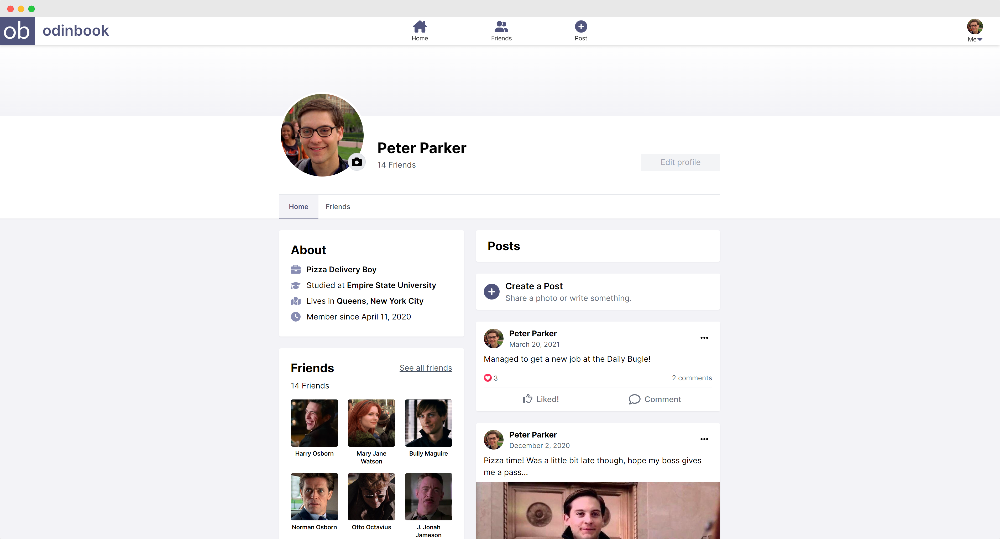

# Odinbook
This is the parent repository for [odinbook](https://odinbook-dm.herokuapp.com/) - a social media website created as part of [The Odin Project](https://www.theodinproject.com/) NodeJS course. This repository was created as the base repository for deploying to Heroku, and contains a frontend and backend submodule. Please view the frontend and backend repostories for more detailed information. An overview of the project is also found here.

Visit the [frontend repository »](https://github.com/daniel-moderiano/odinbook-frontend)

Visit the [backend repository »](https://github.com/daniel-moderiano/odinbook-backend)

## About the project

[Odinbook](https://odinbook-dm.herokuapp.com/) is a Facebook-esque social media website with the ability to create profiles, make posts and comments, and grow your friend network.

### Features

* **Friend requests:** send, receive, and even cancel or delete friend requests. Operates in a similar Fashion to Facebook's own friend request system.
* **Image uploads:** add or update profile pictures, and attach images to your posts. Odinbook also gives image thumbnail previews while working with images.
* **Demo account:** jump right in and experience all of odinbook's  features by using the entertaining test account. No sign-in required!
* **Facebook login:** a production-ready 'Log in with Facebook' feature that supports creating new accounts with, and logging in with your Facebook credentials.

### Technologies used

Odinbook is a full stack MERN application, using Tailwind CSS for design. Learn more about these technologies below:

* [React](https://reactjs.org/) - Frontend JavaScript framework
* [Tailwind CSS](https://tailwindcss.com/) - Frontend CSS styling
* [NodeJS](https://nodejs.org/en/) - Backend JavaScript runtime
* [Express](https://expressjs.com/) - Backend NodeJS web application framework
* [MongoDB](https://www.mongodb.com/) - Application database platform
* [AWS](https://aws.amazon.com/) - Cloud Computing Services

## Acknowledgments

The following resources were a great help throughout the development of Odinbook.

* [Randall Deggess](https://www.rdegges.com/) and his NodeJS/JWT authentication talks
* [Traversy Media](https://www.youtube.com/channel/UC29ju8bIPH5as8OGnQzwJyA) for general MERN stack advice
* [Zach Gollwitzer](https://www.youtube.com/c/ZachGollwitzer) for the best Passport and Express session reference
* [Adrian Cantrill](https://learn.cantrill.io/) for in-depth, understanding-focused AWS courses
